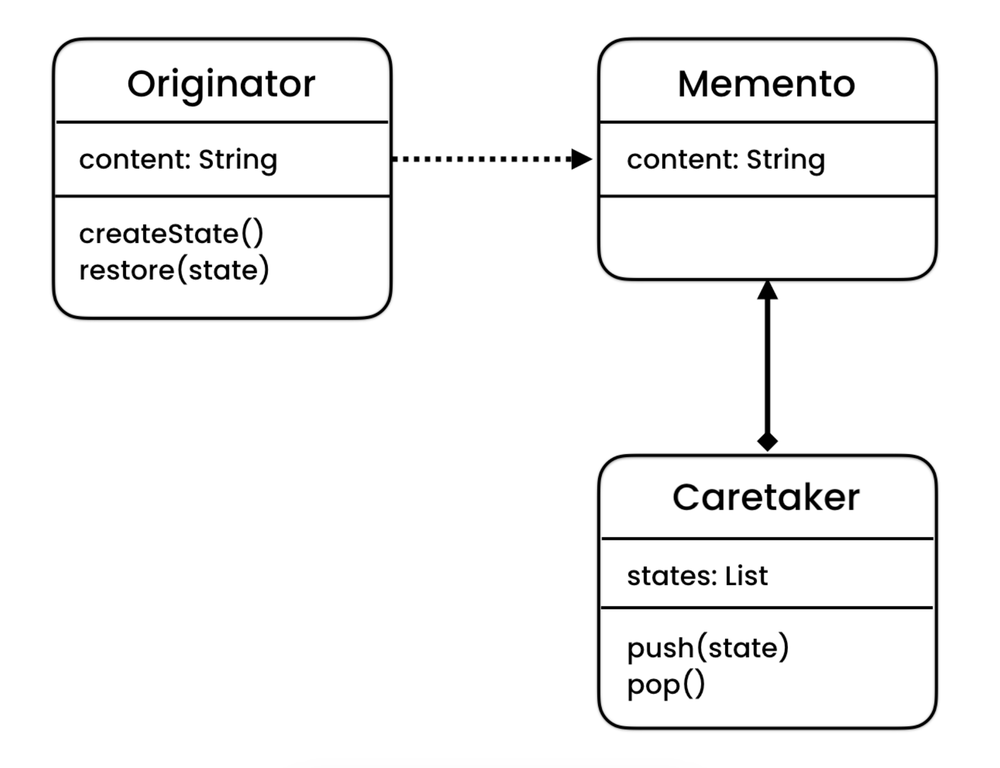

# Design Patterns
> The goal of using design pattern is to design reusable and extensible object-oriented software.

### What is Design Pattern?
Design patterns are elegant solution to repeating problem in software design. 
This repo will cover 23 Design patterns that were originally documented in the book named "Elements of Reusable object-oriented software" by Gang Of Four.

The GoF pattern include 23 design patterns that are divided into 3 categories:
1. Creational - Deals with different ways to create an object.
2. Structural - Deals with relationship between objects.
3. Behavioural - Deals with communication between these objects.

## 01-Essentials
Before learning design patterns it is important to learn the pre-requisite
* **Coupling:** The level of dependencies between the class and its helper class is known as coupling.
* **Interfaces:** It is a contract that specifies the capabilities that a class should provide. Interfaces can help us build loosely coupled application.

### 4 Principles of OOPs:
1. **Encapsulation**: Encapsulating the data and the behaviour of the class.
2. **Abstraction**: Reduce complexity by hiding unnecessary details.
3. **Inheritance**: Child class should inherit the behaviour of parent class.
4. **Polymorphism**: Ability of an object to take many different forms.

### Unified Modelling Language:
It is graphical representation of how we represent our classes and their communication.  
Below is the representation of the following class.
  
The minus `-` sign means that the field is private & The plus `+` sign represents that the field is public. In this repo it is assumed that all our variables are private and methods are public.

Below is the representation of an inheritance relationship:

Below is the representation of composition relationship (The shape class is composed of size class):  

Below is the representation of a dependency relationship. Denoted by dashed line:

## 02-Memento-Pattern
It is a part of behavioural design pattern. Memento Pattern is used to implement UNDO mechanism.
When we want to save the state of the object and also restore it.

### Problem:
Suppose we have a class called `Editor` with a field `String content`. Now, we want to implement 
an undo mechanism on the `Editor` class.

### Solutions:
Solution 1:   
Use a field called prevContent that would store the previous state of the `content` field. The problem with this approach is that we can only undo once.

Solution 2:  
Use a list of prevContents. The problem with this approach is that if we add another field called name then we need to create
another list of prevName and this behaviour will keep growing on if we are adding a new field.
Hence this solution is not extensible. (not designed to allow the addition of new capabilities and functionality)

Solution 3:  
We can use an extra class called `EditorState` that is purely responsible for storing the state of editor at the given time. 
Now in our `Editor` class instead of storing list of the fields we store a list of `EditorState`.  
But this would violate an important OOP principle called "Single Responsibility Principle". As `Editor` class is responsible for
2 things: one is to behave as an editor and other is state management. We need to take the state management responsibility 
outside the `Editor` class.
> Single Responsibility Principle: Every class should have a single responsibility.

Solution 3: (Memento Pattern)  
We create another class called `History` that would be responsible for state management. `History` class will contain the 
list of `EditorState` and `push(state) & pop()` method to push & pop an editorState.  
In `Editor` class 2 new methods would be introduced, One is `createState()` this would create an `editorState` object based on the 
current contents of the `editor` object and will return it. Another method will be ``restore(editorState)`` this will restore the contents to prevContent.  
Refer: [memento-code](src/main/java/memento)  

This pattern is called memento pattern. In the original GoF book the classes have been renamed.
* Editor becomes Originator
* EditorState becomes Memento
* History becomes Caretaker

## 03-State-Pattern
It is a part of behavioural design pattern. State pattern is used when we want an object to behave differently depending on the different conditions.
### Problem:
Let's say we have a Paint application that has 2 tools Pen and eraser. Now, depending on the tool we have selected 
our paint application should respond differently to mouse events such as mouse up and mouse down.   
Assume that we have a canvas class that will call the methods `mouseUp()` and `mouseDown()` 

### Solutions:
Solution 1:  
Use if, else-if and else conditional statements to implement this kind of behaviour but this solution is not extensible at all.  
This approach is not maintainable as more tools (which definitely will) come in picture this if-else conditional would grow out of hand.  

Solution 2: (State pattern)   
Introduce an interface or abstract class called `Tool` having mouseUp() and mouseDown() method declaration. Introduce different 
tool classes such as `Pen`, `Eraser` as a child class of the `Tool` interface. Now, these tool classes need 
to implement the method `mouseUp()` and `mouseDown()`. In our canvas class we will be working with Tool interface, we can use 
setter to set the tool to either Pen or Eraser.  
Refer: [state-code]()   

This pattern follows Open Closed Principle.
> Open Closed Principle states that our classes should be open for extension and close for modification.

With this pattern we can easily add new features by adding new class without modifying the old ones.

This pattern is called state pattern. In the original GoF book the classes and methods have been renamed.  

#### Abusing Patterns:
Every pattern has a context behind it. While using the design pattern it is important to keep in mind the context.  
Implementing the pattern without it actually in need can cause code smell and make our program complex. We should avoid 
over-engineering. Don't blindly apply the pattern anywhere without understanding the context of the problem.  

## 04-Iterator-Pattern
It is a part of behavioural design pattern. It is used to iterate over a list/stack or anything that is a collection without needing to know the 
internal details. 

### Problem:
To iterate over a list we may use a for-loop but what if internally we change the list to be an array of fixed size. This 
would break the system.

### Solution (Iterator Pattern)
Introduce an interface having 3 different methods: 
1. hasNext() returns true if there is any more item to iterate
2. current() returns the current item
3. next() moves the pointer to the next element.

Now if we are using List internally we will create a class called ListIterator that would implement the iterator iterface 
that we just created. Implement the abstract method accordingly. In the BrowserHistory class we will have a method called `createIterator()` 
that would just return the iterator.  
Now to iterate over the items we can use the following approach: [Main.java](src/main/java/iterator/Main.java)  
This is the iterator pattern.  

